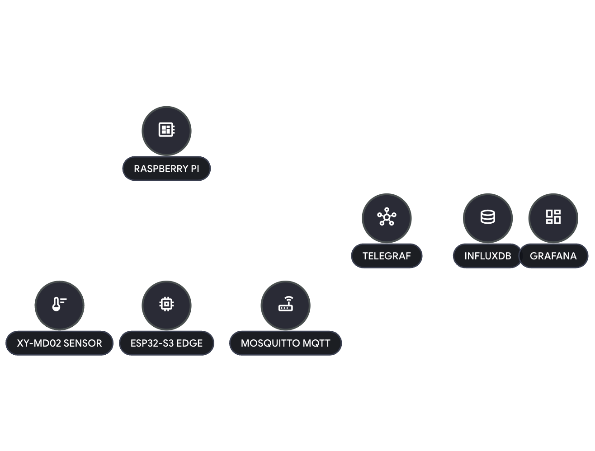

# ESP32-S3 Weather Station (TIG Stack + MQTT)

A weather monitoring system using an ESP32-S3, an XY-MD02 Modbus RTU temperature/humidity sensor, an Eastron SDM120 Modbus RTU power meter, and a TIG (Telegraf, InfluxDB, Grafana) stack for data visualization.

## 🚀 Quick Start

### 1. Docker Setup
```bash
cd weatherstation_docker/
docker-compose up -d
```
- **MQTT**: `localhost:1883`
- **InfluxDB**: `localhost:8086` (Token: `mysecrettoken`)
- **Grafana**: `localhost:3000` (User/Pass: `admin/admin`)

### 2. Firmware Setup
1. Open `firmware/src/firmware/firmware.ino` in Arduino IDE.
2. Configure `secrets.h` with WiFi and MQTT Broker IP.
3. Install libraries: `MQTT` (Joel Gaehwiler), `modbus-esp8266`.
4. Board: **ESP32S3 Dev Module** with **USB CDC On Boot** enabled.
5. Upload.

## 🏗️ Architecture


- **ESP32-S3**: Polls the XY-MD02 and SDM120 via RS485 (Modbus RTU), publishes existing weather JSON to MQTT, and serves weather plus power-meter values as a Modbus TCP slave.
- **TIG Stack**: Dockerized Telegraf (collection), InfluxDB (storage), and Grafana (visualization).
- **Network**: Uses mDNS (`esp32s3-weather.local`) for easy discovery.

## 📊 Data & Visualization

### Grafana Setup
1. Connect InfluxDB as a data source (Flux, `http://influxdb:8086`, Org: `weatherstation`, Token: `mysecrettoken`).
2. Build dashboards using the weather telemetry fields: `temperature`, `humidity`, `status`, `poll_count`.

Power meter values are currently exposed through the ESP32 Modbus TCP slave only. MQTT, InfluxDB, and Grafana wiring for SDM120 values is intentionally left for a later change.

### Documentation
- 💡 **[Flux Queries](docs/flux_queries.md)** — Detailed queries for all metrics.
- 📈 **[Querying Guide](docs/querying_guide.md)** — Advanced patterns and Grafana variables.
- 📺 **[Kiosk Setup](docs/kiosk_setup.md)** — Dedicated 7" touchscreen display instructions.

<details>
<summary><b>🔍 Optional: Modbus TCP Verification</b></summary>

The ESP32 serves weather and SDM120 power-meter data on port 502. Use `mbpoll` to verify:
```bash
mbpoll -a 1 -t 4 -r 1 -c 21 esp32s3-weather.local
```
| HREG | Field | Encoding |
|------|-------|----------|
| 0 | Temperature | raw × 0.1 °C, signed |
| 1 | Humidity | raw × 0.1 %RH, unsigned |
| 2 | Weather status | 0=OK, 1=timeout, 2=CRC err, 3=exception, 4=bad response |
| 3 | Poll count | uint16, increments per successful weather RTU poll |
| 4 | SDM120 status | same status codes |
| 5-6 | Voltage | IEEE754 float, high word then low word |
| 7-8 | Current | IEEE754 float, high word then low word |
| 9-10 | Active power | IEEE754 float, high word then low word |
| 11-12 | Apparent power | IEEE754 float, high word then low word |
| 13-14 | Reactive power | IEEE754 float, high word then low word |
| 15-16 | Power factor | IEEE754 float, high word then low word |
| 17-18 | Frequency | IEEE754 float, high word then low word |
| 19-20 | Total active energy | IEEE754 float, high word then low word |
</details>

<details>
<summary><b>🥧 Pi Host Telemetry</b></summary>

Telegraf also collects Raspberry Pi system metrics (CPU, RAM, Disk, Temperature) and stores them in the `sensors` bucket. See [docs/flux_queries.md](docs/flux_queries.md) for examples.
</details>

## 🚢 Deployment & Security
- **Moving to Production**: Copy `weatherstation_docker/` to your Pi and update `MQTT_BROKER` in the firmware.
- **Security**: This is a LAN-only setup. See [PROGRESS.md](PROGRESS.md) for the production readiness checklist (Authentication, Secrets management, TLS).

## 🛠️ Project Structure
```text
.
├── weatherstation_docker/   # TIG + MQTT Stack configurations
└── firmware/
    └── src/
        └── firmware/        # ESP32 Source Code
```

## 📈 Roadmap
Ongoing development tasks and production-readiness gaps are tracked in **[PROGRESS.md](PROGRESS.md)**.
